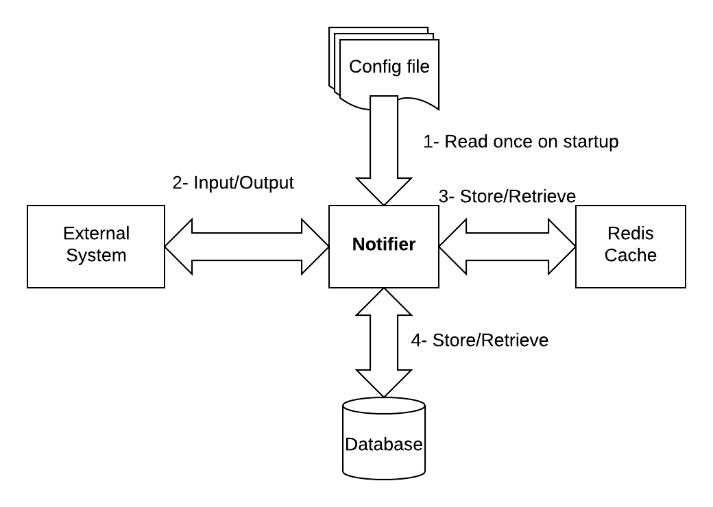

# Notifier:

----

## Description:
	A notification microservice which is responsible for storing/retrieving/caching notifications.

----

## Architecture:




### 1- Config File:
	    a- IP / Port : for external system
	    b- Rotation Policy (when to remove from Redis Cache) : 
		      i. Time Based : eg. every 20 min
		      ii. Retrieval (when data retrieved from Redis remove it assuming that it was read by user)	
		      iii. mixed
	    c. DataBaseConfigPath :
		      i. IP
		      ii. Port
		      iii. Credentials
		      iv. Name
	    d. Redis Config
	      	i. Host

### 2- External System:
	    As was specified in web com.linkedin.replica.services.

### 3- Redis:
	    a. Caching most recent notifications that did not marked as read.
	    b. Storage Model can be done using Redis Hashes. Hashes are a very convenient data type when you want
	       to access object’s properties individually since you do not need to retrieve the whole object.	      
```java 
// Example for Redis Hashes
jedis.hset("user#1", "sender", "Peter");
String name = jedis.hget("user#1", "sender");
```
	
### 4- Database: 
	    Storing data as was specified in Notifications.json.


			
